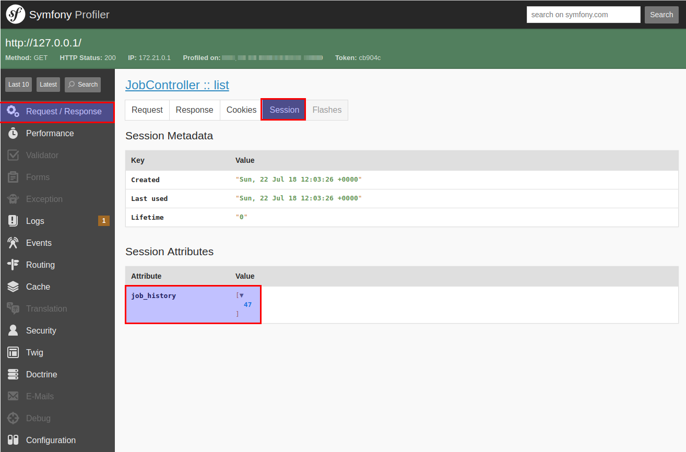
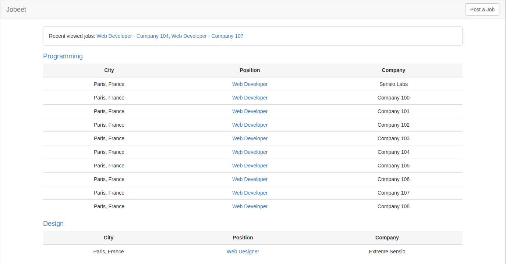
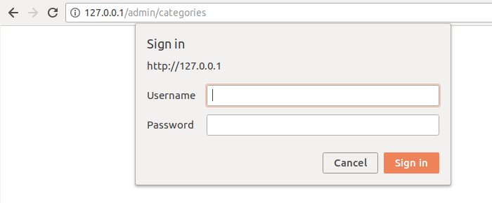
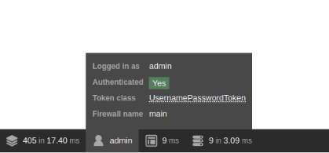

# Jobeet Day 11: The User

Yesterday was packed with a lot of information.

Today, we will discover how symfony manages persistent data between HTTP requests. As you might know, the HTTP protocol is stateless, which means that each request is independent from its preceding or proceeding ones. Modern websites need a way to persist data between requests to enhance the user experience.

A user session can be identified using a cookie. In Symfony, the developer does not need to manipulate the session directly, but rather uses the `Session` object from `HttpFoundation` component.

## User Flashes

We have already seen flash messages in action. A flash is an ephemeral message stored in the session that will be automatically deleted after the very next request.
It is very useful when you need to display a message to the user after a redirect.


A flash is set by using the `addFlash()` method in controller:

```php
$this->addFlash('notice', 'Your job was published');
```

The first argument is the identifier of the flash and the second one is the message to display.
You can define whatever flashes you want, but **notice** and **error** are two of the more common ones.

It is up to the developer to include the flash message in the templates.
Message shown above is rendered in `templates/job/show.html.twig`:

```twig

    <div class="alert alert-success" role="alert">
        {{ message }}
    </div>

```

## User Session

Unfortunately, the Jobeet user stories have no requirement that includes storing something in the user session.
So let's add a new requirement: to ease job browsing, the last three jobs viewed by the user should be displayed in the menu with links to come back to the job page later on.

When a user access a job page, the displayed job object needs to be added in the user history and stored in the session.
It's better to organize this logic in service from the beginning. Create new service `JobHistoryService` in already existing folder `/src/Service`:

```php
namespace App\Service;

use App\Entity\Job;
use Doctrine\ORM\EntityManagerInterface;
use Symfony\Component\HttpFoundation\Session\SessionInterface;

class JobHistoryService
{
    private const MAX = 3;

    /** @var SessionInterface */
    private $session;

    /** @var EntityManagerInterface */
    private $em;

    /**
     * @param SessionInterface $session
     * @param EntityManagerInterface $em
     */
    public function __construct(SessionInterface $session, EntityManagerInterface $em)
    {
        $this->session = $session;
        $this->em = $em;
    }

    /**
     * @param Job $job
     *
     * @return void
     */
    public function addJob(Job $job) : void
    {
        // add job to session
    }

    /**
     * @return Job[]
     */
    public function getJobs() : array
    {
        // get jobs from session
    }
}
```

We already have constant `MAX` that will be used to limit the number of jobs in history.
Also we have injected `Session` class from `HttpFoundation` component that will be used to work with session storage and `EntityManager` class to fetch jobs from database.

> Do not work directly with `$_SESSION` superglobal and use services provided by Symfony!

Use `JobHistoryService` in controller to add jobs to session:

```php
// ...
use App\Service\JobHistoryService;

class JobController extends AbstractController
{
    // ...
    
    /**
     * Finds and displays a job entity.
     *
     * @Route("job/{id}", name="job.show", methods="GET", requirements={"id" = "\d+"})
     *
     * @Entity("job", expr="repository.findActiveJob(id)")
     *
     * @param Job $job
     * @param JobHistoryService $jobHistoryService
     *
     * @return Response
     */
    public function show(Job $job, JobHistoryService $jobHistoryService) : Response
    {
        $jobHistoryService->addJob($job);

        return $this->render('job/show.html.twig', [
            'job' => $job,
        ]);
    }
    
    // ...
}
```

Now let's write the implementation for `addJob` method:

```php
// ...

class JobHistoryService
{
    // ...

    /**
     * @param Job $job
     *
     * @return void
     */
    public function addJob(Job $job) : void
    {
        $jobs = $this->getJobIds();

        // Add job id to the beginning of the array
        array_unshift($jobs, $job->getId());

        // Remove duplication of ids
        $jobs = array_unique($jobs);

        // Get only first 3 elements
        $jobs = array_slice($jobs, 0, self::MAX);

        // Store IDs in session
        $this->session->set('job_history', $jobs);
    }
    
    /**
     * @return array
     */
    private function getJobIds() : array
    {
        return $this->session->get('job_history', []);
    }
    
    // ...
}
```

> We could have feasibly stored the Job objects directly into the session. This is strongly discouraged because the session variables are serialized between requests. And when the session is loaded, the Job objects are de-serialized and can be "stalled" if they have been modified or deleted in the meantime.

Open view page of random job and there will be no visible changes but we know that something should appear in session.
To track request session open Symfony Profiler from bottom toolbar (or directly: [http://127.0.0.1/_profiler][2] and select the last request), open "Request / Response" from left menu and "Session" tab:



there you can see key we used to store our ids and the current value *(in my case job was with id 47)*.

Now use these ids to fetch jobs from database:

```php
// ...

class JobHistoryService
{
    // ...

    /**
     * @return Job[]
     */
    public function getJobs() : array
    {
        $jobs = [];
        $jobRepository = $this->em->getRepository(Job::class);

        foreach ($this->getJobIds() as $jobId) {
            $jobs[] = $jobRepository->findActiveJob($jobId);
        }

        return $jobs;
    }
}
```

Note that we used `findActiveJob` method from repository and if job from history become inactive then it will not be displayed.

Use this method in controller to pass jobs to template:

```php
// ...

class JobController extends AbstractController
{
    /**
     * Lists all job entities.
     *
     * @Route("/", name="job.list", methods="GET")
     *
     * @param EntityManagerInterface $em
     * @param JobHistoryService $jobHistoryService
     *
     * @return Response
     */
    public function list(EntityManagerInterface $em, JobHistoryService $jobHistoryService) : Response
    {
        $categories = $em->getRepository(Category::class)->findWithActiveJobs();

        return $this->render('job/list.html.twig', [
            'categories' => $categories,
            'historyJobs' => $jobHistoryService->getJobs(),
        ]);
    }
    
    // ...
}
```

and render in `templates/job/list.html.twig`:

```twig



    
        <div class="panel panel-default">
            <div class="panel-body">
                Recent viewed jobs:
                
                    <a href="{{ path('job.show', {id: historyJob.id}) }}">{{ historyJob.position ~ ' - ' ~ historyJob.company}}</a>{{ loop.last ? '' : ', ' }}
                
            </div>
        </div>
    
    
    <h4>{{ category.name }}</h4>
    
    {# ... #}

```

But don't forget that we have one route in `CategoryController` with similar functionality and it would be good to display jobs history too.
Move the `div` with all inner content to separate file `templates/job/_job_history.html.twig`:

```twig

    <div class="panel panel-default">
        <div class="panel-body">
            Recent viewed jobs:
            
                <a href="{{ path('job.show', {id: historyJob.id}) }}">{{ historyJob.position ~ ' - ' ~ historyJob.company}}</a>{{ loop.last ? '' : ', ' }}
            
        </div>
    </div>

```

and replace displaying in `job/list.html.twig`:

```twig



    Jobs in the {{ category.name }} category



    

    <h4>{{ category.name }}</h4>

    {# ... #}

```

Code became more reusable. Do adjustments in `CategoryController`:

```php
// ...
use App\Service\JobHistoryService;

class CategoryController extends Controller
{
    /**
     * Finds and displays a category entity.
     *
     * @Route(
     *     "/category/{slug}/{page}",
     *     name="category.show",
     *     methods="GET",
     *     defaults={"page": 1},
     *     requirements={"page" = "\d+"}
     * )
     *
     * @param Category $category
     * @param int $page
     * @param PaginatorInterface $paginator
     * @param JobHistoryService $jobHistoryService
     *
     * @return Response
     */
    public function show(
        Category $category,
        int $page,
        PaginatorInterface $paginator,
        JobHistoryService $jobHistoryService
    ) : Response {
        $activeJobs = $paginator->paginate(
            $this->getDoctrine()->getRepository(Job::class)->getPaginatedActiveJobsByCategoryQuery($category),
            $page,
            $this->getParameter('max_jobs_on_category')
        );

        return $this->render('category/show.html.twig', [
            'category' => $category,
            'activeJobs' => $activeJobs,
            'historyJobs' => $jobHistoryService->getJobs(),
        ]);
    }
}
```

and reuse `_job_history.html.twig` in `category/show.html.twig`:

```twig
{# ... #}


    

    <h4>{{ category.name }}</h4>

    {# ... #}

```

Now user will see recently viewed jobs:



## Application Security

### Authentication

Like many other symfony features, security is managed by a YAML file, `security.yml`.
For instance, you can find the default configuration for the application in the `config/packages` directory:

```yaml
security:
    providers:
        in_memory: { memory: ~ }

    firewalls:
        dev:
            pattern: ^/(_(profiler|wdt)|css|images|js)/
            security: false
        main:
            anonymous: ~
```

From the beginning we have two `firewalls`: `dev` isn't important, it's used only in dev mode and gives access to some dev routes, but `main` firewall handles all other routes because there is no `pattern` key.

Let's activate HTTP basic authentication in `main` firewall:

```diff
  security:
      providers:
          in_memory: { memory: ~ }
  
      firewalls:
          dev:
              pattern: ^/(_(profiler|wdt)|css|images|js)/
              security: false
          main:
              anonymous: ~
+             http_basic: ~
```

and restrict access for routes that start with `/admin` to be accessible only by users with role `ROLE_ADMIN`:

```diff
  security:
      providers:
          in_memory: { memory: ~ }
  
      firewalls:
          dev:
              pattern: ^/(_(profiler|wdt)|css|images|js)/
              security: false
          main:
              anonymous: ~
              http_basic: ~

+     access_control:
+         - { path: ^/admin, roles: ROLE_ADMIN }
```

Open any admin route and you will be requested to provide login and password:



We don't have any users in database, but Symfony gives us possibility to list users directly in this `yaml` file too:

```diff
  security:
      providers:
          in_memory:
+            memory:
+                users:
+                    admin:
+                        password: someStrongPassword
+                        roles: 'ROLE_ADMIN'
 
+     encoders:
+        Symfony\Component\Security\Core\User\User: plaintext
  
      firewalls:
          dev:
              pattern: ^/(_(profiler|wdt)|css|images|js)/
              security: false
          main:
              anonymous: ~
              http_basic: ~
  
      access_control:
          - { path: ^/admin, roles: ROLE_ADMIN }
  
```

Try to login using username `admin` and password `someStrongPassword`. It should work!

User provider loads user information and put it into a `User` object. If you load users from the database or some other source, you'll use your own custom User class. But when you use the "in memory" provider, it gives you a `Symfony\Component\Security\Core\User\User` object.

Whatever your User class is, you need to tell Symfony what algorithm was used to encode the passwords. In this case, the passwords are just `plaintext`.

If you refresh now, you'll be logged in! The web debug toolbar even tells you who you are and what roles you have:



## Additional information
- [Session Management][1]
- [Security][3]

## Next Steps

Continue this tutorial here: Jobeet Day 12: The Mailer

Previous post is available here: [Jobeet Day 10: The Admin](day-10.md)

Main page is available here: [Symfony 4.1 Jobeet Tutorial](../index.md)

[1]: https://symfony.com/doc/4.1/components/http_foundation/sessions.html
[2]: http://127.0.0.1/_profiler
[3]: https://symfony.com/doc/4.1/security.html
